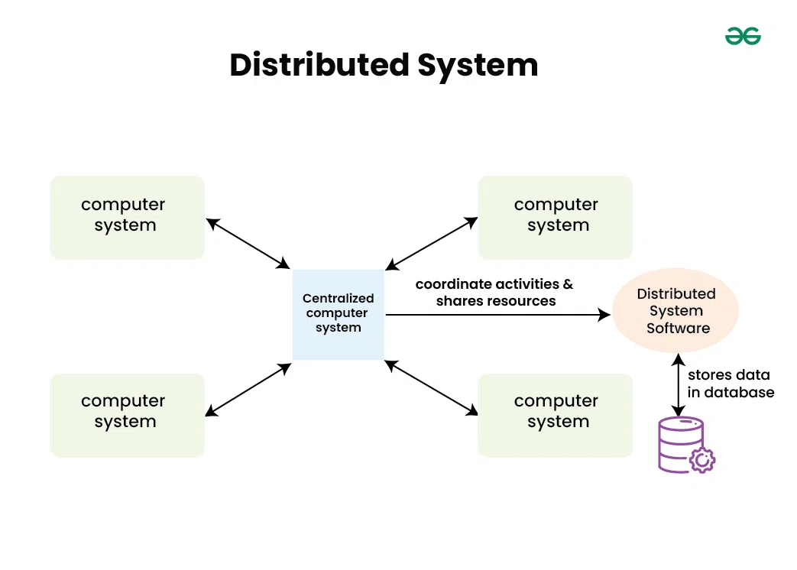
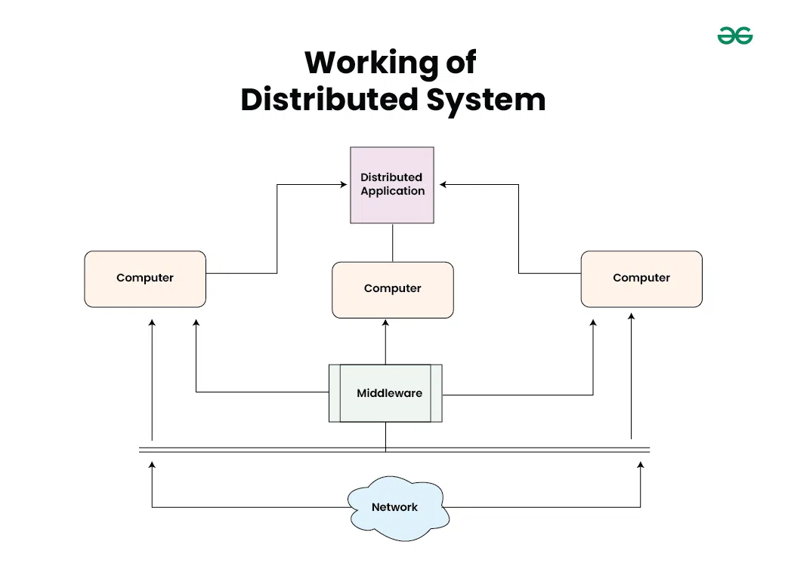
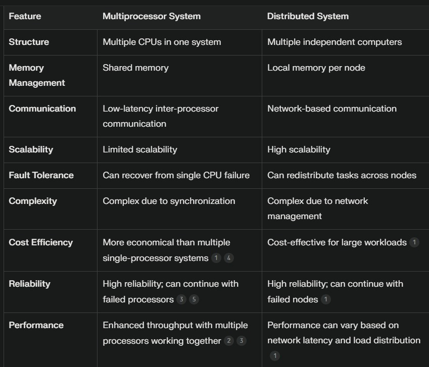
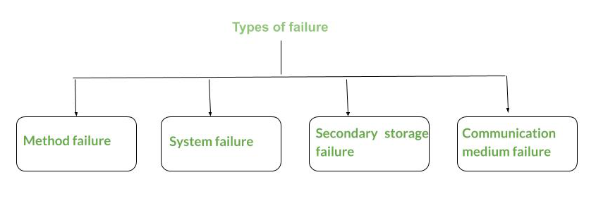

# MODULE 1

# What is a Distributed System?

**Last Updated:** 13 Nov, 2024

A distributed system is a collection of independent computers that appear to the users of the system as a single coherent system. These computers or nodes work together, communicate over a network, and coordinate their activities to achieve a common goal by sharing resources, data, and tasks.

## Difference between centralized system and distributed system

In a centralized system, all data and computational resources are kept and controlled in a single central place, such as a server. Applications and users connect to this hub in order to access and handle data. Although this configuration is easy to maintain and secure, if too many users access it simultaneously or if the central server malfunctions, it could become a bottleneck.

A distributed system, on the other hand, disperses data and resources over several servers or locations, frequently across various physical places. Better scalability and reliability are made possible by this configuration since the system can function even in the event of a component failure. However, because of their numerous points of interaction, distributed systems can be more difficult to secure and administer.

| **Aspect**             | **Centralized System**                                                                                                   | **Distributed System**                                                                                                         |
|-------------------------|------------------------------------------------------------------------------------------------------------------------|-----------------------------------------------------------------------------------------------------------------------------|
| **Data & Resources**    | Stored and controlled in a single central location (e.g., a server).                                                    | Dispersed across multiple servers or locations, often geographically separated.                                              |
| **Access**              | Applications and users connect to a central hub to access data.                                                        | Users interact with multiple nodes or servers for data access.                                                               |
| **Reliability**         | If the central server fails, the entire system may be non-operational.                                                  | Ensures reliability as the system can operate even if some components fail.                                                  |
| **Scalability**         | Limited scalability due to reliance on a single server; bottlenecks occur with high user traffic.                       | Highly scalable, as more nodes can be added to accommodate increased demand.                                                 |
| **Security**            | Easier to maintain and secure due to fewer interaction points.                                                         | More complex to secure as data and interactions span multiple servers or locations.                                          |
| **Administration**      | Simple to administer due to a single control point.                                                                    | More challenging to manage due to the need to coordinate multiple nodes.                                                     |
| **Performance**         | Performance may degrade with simultaneous access from many users.                                                      | Typically better performance as the load is distributed across multiple nodes.                                               |

✨Memoization - `DARS SAP`

## Architectures of Distributed systems

Below are some of the common distributed system architectures:

✨ Memoization - `C`lients, who are our fellow `P`eers they requested `T`hree tires as a `M`icro `S`ervice  for an `E`vent.`CPTMSE` 

### Client-Server Architecture

In this setup, servers provide resources or services, and clients request them. Clients and servers communicate over a network.  
**Examples:** Web applications, where browsers (clients) request pages from web servers.

### Peer-to-Peer (P2P) Architecture

Each node, or “peer,” in the network acts as both a client and a server, sharing resources directly with each other. 
**Examples:** File-sharing networks like BitTorrent, where files are shared between users without a central server.

### Three-Tier Architecture

This model has three layers: presentation (user interface), application (business logic), and data (database). Each layer is separated to allow easier scaling and maintenance. 
**Examples:** Many web applications use this to separate user interfaces, logic processing, and data storage.

### Microservices Architecture

The application is split into small, independent services, each handling specific functions. These services communicate over a network, often using REST APIs or messaging. 
**Examples:** Modern web applications like Netflix or Amazon, where different services handle user accounts, orders, and recommendations independently.

### Service-Oriented Architecture (SOA)

Similar to microservices, SOA organizes functions as services. However, SOA typically uses an enterprise service bus (ESB) to manage communication between services. 
**Examples:** Large enterprise applications in finance or government, where different services handle various aspects of business processes.

### Event-Driven Architecture

Components interact by sending and responding to events rather than direct requests. An event triggers specific actions or processes in various parts of the system. 
**Examples:** Real-time applications like IoT systems, where sensors trigger actions based on detected events.

The most common forms of distributed systems today operate over the internet, handing off workloads to dozens of cloud-based virtual server instances that are created as needed, and then terminated when the task is complete.

## Example of a Distributed System

Any Social Media can have its Centralized Computer Network as its Headquarters and computer systems that can be accessed by any user and using their services will be the Autonomous Systems in the Distributed System Architecture.

### Distributed System Software

This Software enables computers to coordinate their activities and to share the resources such as Hardware, Software, Data, etc.

### Database

It is used to store the processed data that are processed by each Node/System of the Distributed systems that are connected to the Centralized network.

### Working of Distributed System

As we can see that each Autonomous System has a common Application that can have its own data that is shared by the Centralized Database System. 
To Transfer the Data to Autonomous Systems, Centralized System should be having a Middleware Service and should be connected to a Network. 
Middleware Services enable some services which are not present in the local systems or centralized system default by acting as an interface between the Centralized System and the local systems. By using components of Middleware Services systems communicate and manage data. 
The Data which is been transferred through the database will be divided into segments or modules and shared with Autonomous systems for processing. 
The Data will be processed and then will be transferred to the Centralized system through the network and will be stored in the database. 

## Characteristics of Distributed System

- **Resource Sharing:** It is the ability to use any Hardware, Software, or Data anywhere in the System.
- **Openness:** It is concerned with Extensions and improvements in the system (i.e., How openly the software is developed and shared with others).
- **Concurrency:** It is naturally present in Distributed Systems, that deal with the same activity or functionality that can be performed by separate users who are in remote locations. Every local system has its independent Operating Systems and Resources.
- **Scalability:** It increases the scale of the system as a number of processors communicate with more users by accommodating to improve the responsiveness of the system.
- **Fault tolerance:** It cares about the reliability of the system if there is a failure in Hardware or Software, the system continues to operate properly without degrading the performance the system.
- **Transparency:** It hides the complexity of the Distributed Systems to the Users and Application programs as there should be privacy in every system.

## Advantages of Distributed System

- **Scalability:** Distributed systems can easily grow by adding more computers (nodes), allowing them to handle increased demand without significant reconfiguration.
- **Reliability and Fault Tolerance:** If one part of the system fails, others can take over, making distributed systems more resilient and ensuring services remain available.
- **Performance:** Workloads can be split across multiple nodes, allowing tasks to be completed faster and improving overall system performance.
- **Resource Sharing:** Distributed systems allow resources like data, storage, and computing power to be shared across nodes, increasing efficiency and reducing costs.
- **Geographical Distribution:** Since nodes can be in different locations, distributed systems can serve users globally, providing faster access to resources based on location.

## Disadvantages of Distributed System

- Relevant Software for Distributed systems does not exist currently.
- Security possess a problem due to easy access to data as the resources are shared to multiple systems.
- Networking Saturation may cause a hurdle in data transfer i.e., if there is a lag in the network then the user will face a problem accessing data.
- In comparison to a single user system, the database associated with distributed systems is much more complex and challenging to manage.
- If every node in a distributed system tries to send data at once, the network may become overloaded.

## Use cases of Distributed System

- **Finance and Commerce:** Amazon, eBay, Online Banking, E-Commerce websites.
- **Information Society:** Search Engines, Wikipedia, Social Networking, Cloud Computing.
- **Cloud Technologies:** AWS, Salesforce, Microsoft Azure, SAP.
- **Entertainment:** Online Gaming, Music, youtube.
- **Healthcare:** Online patient records, Health Informatics.
- **Transport and logistics:** GPS, Google Maps.

## Are Distributed Systems and Microservices the Same?

Distributed systems and microservices are related concepts but not the same. Let’s break down the differences:

### Distributed Systems

- A distributed system is a collection of independent computers that appear to its users as a single coherent system.
- In a distributed system, components located on networked computers communicate and coordinate their actions by passing messages.
- Distributed systems can encompass various architectures, including client-server, peer-to-peer, and more.

### Microservices

- Microservices is an architectural style that structures an application as a collection of small, autonomous services, modeled around a business domain.
- Each microservice is a self-contained unit that can be developed, deployed, and scaled independently.
- Microservices communicate with each other over a network, typically using lightweight protocols like HTTP or messaging queues.

While microservices can be implemented in a distributed system, they are not same. Microservices focus on architectural design principles, emphasizing modularity, scalability, and flexibility, whereas distributed systems encompass a broader range of concepts, including communication protocols, fault tolerance, and concurrency control, among others.

# Why Do We Need a Distributed System?

The demand for distributed systems has grown due to the increasing complexity of modern applications and the need for scalability, reliability, and flexibility. This article explores why distributed systems are essential, their benefits, challenges, practical considerations, and real-world use cases.  

## Reasons for Using Distributed Systems

Distributed systems are crucial in modern computing for their ability to scale, ensure reliability, and optimize performance across a network of interconnected nodes. Here are some key reasons:

- **Scalability:** Distributed systems allow applications to scale horizontally by distributing workloads across multiple nodes, handling increased user demand and data volume effectively.
- **Fault Tolerance:** By replicating data and services across multiple nodes, distributed systems can continue to operate even during hardware failures or network disruptions, ensuring high availability and reliability.
- **Performance:** Distributed systems leverage parallel processing and distributed computing resources to improve performance and reduce latency, providing faster response times and better user experiences.
- **Geographical Distribution:** Organizations can deploy services closer to end-users or in multiple geographical regions, reducing latency and improving global access to resources.
- **Data Management:** Distributed systems offer efficient data storage solutions that handle large volumes of data, support complex queries, and ensure data consistency and integrity across distributed environments.
- **Cost Efficiency:** By distributing workloads and optimizing resource utilization, distributed systems can achieve cost efficiencies in hardware, infrastructure, and operational expenses.
- **Flexibility:** Distributed systems offer flexible deployment, allowing organizations to adapt to changing requirements, scale resources dynamically, and integrate new technologies seamlessly.  

## Challenges of Using Distributed Systems

Despite their benefits, distributed systems present several challenges:

- **Consistency and Coherency:** Ensuring data consistency and coherency across distributed nodes can be challenging, especially with concurrent updates and network delays.
- **Complexity:** The inherent complexity of distributed systems, including network communication, data partitioning, and fault tolerance mechanisms, can pose challenges in design, implementation, and maintenance.
- **Security:** Distributed systems face security risks such as data breaches, unauthorized access, and denial-of-service attacks, requiring robust authentication, encryption, and access control mechanisms.
- **Synchronization:** Coordinating and synchronizing operations across distributed nodes while maintaining performance and scalability can be difficult, particularly in distributed databases and transactional systems.
- **Resource Management:** Efficient resource management, including load balancing, resource allocation, and scheduling, is essential for maximizing resource utilization and performance in distributed systems.

# Difference between microprocessor and distributed processor:

# Goals of Distributed Systems

In this digital world, a distributed system is a network of interconnected computers that enhances user experience, resource utilization, scalability, reliability, and performance. This article explores the goals of a distributed system in an easy-to-understand manner.  

## Goals of Distributed Systems

### 1. Boosting Performance

Distributed systems improve performance by dividing large tasks into smaller chunks and processing them simultaneously across different computers. This is similar to a group of people working together on a project. For example, when you search for something on the internet, the search engine distributes the work among several servers and retrieves the results in a few seconds.  

### 2. Enhancing Reliability

Distributed systems ensure reliability by minimizing the impact of individual computer failures. If one computer fails, others keep the system running smoothly. For example, if one server in a social media platform has an issue, you can still access photos and posts because the system quickly switches to another server.  

### 3. Scaling for the Future

Distributed systems are designed to handle increased demands by adding more computers to the system. This allows them to run smoothly and accommodate more users.  

### 4. Resourceful Utilization

One of the most prominent features of distributed systems is efficient resource utilization. Instead of overloading one computer, tasks are distributed among available resources, ensuring that every resource is utilized effectively.

# Distributed Systems: Availability, Transparency, Openness, and Scalability

**Last Updated:** [Insert Date]

Distributed systems are networks of interconnected computers that work together to achieve common goals. This article explores key aspects of distributed systems: availability, transparency, openness, and scalability.  

## Availability

### Definition

Availability in distributed systems refers to the system's ability to remain operational and accessible to users despite failures or disruptions.  

### Importance

- **High Uptime:** Ensures that the system is available for use most of the time.
- **Reliability:** Maintains system functionality even during component failures.
- **User Trust:** Builds confidence among users that the system will be accessible when needed.  

### Techniques to Improve Availability

- **Redundancy:** Using duplicate components to take over in case of failure.
- **Failover Mechanisms:** Automatically switching to a standby system when the primary system fails.
- **Load Balancers:** Distributing incoming requests across multiple servers.
- **Geographic Redundancy:** Deploying servers in different geographic locations to avoid single points of failure.  

## Transparency

### Definition

Transparency in distributed systems means hiding the complexity of the system from users and applications, making it appear as a single, coherent system.  

### Importance

- **Ease of Use:** Simplifies user interaction with the system.
- **Consistency:** Ensures a uniform experience across different parts of the system.
- **Abstraction:** Allows developers to focus on application logic without worrying about underlying complexities.  

### Techniques to Achieve Transparency

- **Location Transparency:** Hiding the physical location of resources.
- **Migration Transparency:** Allowing resources to move without affecting users.
- **Replication Transparency:** Masking the duplication of data and services.
- **Concurrency Transparency:** Managing simultaneous operations seamlessly.  

## Openness

### Definition

Openness in distributed systems refers to the ability to extend and integrate new components, technologies, and standards easily.  

### Importance

- **Flexibility:** Allows the system to adapt to changing requirements.
- **Interoperability:** Ensures compatibility with various technologies and standards.
- **Innovation:** Encourages the development and integration of new features and services.  

### Techniques to Achieve Openness

- **Standard Protocols:** Using widely accepted communication protocols.
- **Modular Design:** Building the system with independent, interchangeable components.
- **APIs:** Providing application programming interfaces for easy integration.
- **Open Source:** Leveraging open-source software for community-driven development.  

## Scalability

### Definition

Scalability in distributed systems is the ability to handle increased loads by adding resources without significant performance degradation.  

### Importance

- **Performance:** Ensures the system can handle more users and data efficiently.
- **Cost-Effectiveness:** Allows the system to grow without requiring expensive upgrades.
- **Future-Proofing:** Prepares the system for future demands and growth.  

### Techniques to Achieve Scalability

- **Horizontal Scaling:** Adding more nodes to the system.
- **Vertical Scaling:** Enhancing the capacity of existing nodes.
- **Sharding:** Dividing the database into smaller, more manageable pieces.
- **Load Balancing:** Distributing workloads evenly across servers.
- **Caching:** Storing frequently accessed data closer to the user to reduce latency.  

## Conclusion

Understanding and implementing availability, transparency, openness, and scalability are crucial for designing effective distributed systems. These aspects ensure that the system is reliable, easy to use, flexible, and capable of handling future demands efficiently.

# Design Issues of Distributed Systems

A distributed system is a collection of autonomous computer systems that are physically separated but connected by a centralized computer network equipped with distributed system software. These systems are used in various applications like online gaming, web applications, and cloud computing. Creating a distributed system involves several design considerations.  

## Scalability

### Challenges

- **Handling Increased Load:** The system must scale with the increasing number of users or requests without performance degradation.
- **Geographic Distribution:** Ensuring performance across geographically dispersed locations.

### Strategies to Achieve Scalability

- **Horizontal Scaling:** Adding more nodes to the system.
- **Vertical Scaling:** Enhancing the capacity of existing nodes.
- **Sharding:** Dividing the database into smaller, more manageable pieces.  

## Reliability

### Fault Tolerance

- **Redundancy:** Using duplicate components to take over in case of failure.
- **Failover Mechanisms:** Automatically switching to a standby system when the primary system fails.

### Redundancy and Replication

- **Data Replication:** Storing copies of data on multiple nodes to ensure availability and reliability.
- **Consensus Algorithms:** Ensuring consistency among replicated data (e.g., Paxos, Raft).  

## Availability

### Uptime and Downtime Considerations

- **High Availability Architectures:** Designing systems to minimize downtime.
- **Monitoring and Alerting:** Using tools to detect and respond to issues promptly.

### Techniques to Improve Availability

- **Load Balancers:** Distributing incoming requests across multiple servers.
- **Geographic Redundancy:** Deploying servers in different geographic locations to avoid single points of failure.  

## Consistency

### Data Consistency Models

- **Strong Consistency:** Ensuring that all nodes see the same data at the same time.
- **Eventual Consistency:** Allowing for temporary discrepancies between nodes, with eventual convergence.

### Trade-offs between Consistency and Availability (CAP Theorem)

- **CAP Theorem:** Understanding the trade-off between Consistency, Availability, and Partition Tolerance.  

## Latency

### Sources of Latency

- **Network Delays:** Time taken for data to travel across the network.
- **Processing Delays:** Time taken for nodes to process requests.

### Minimization Techniques

- **Caching:** Storing frequently accessed data closer to the user.
- **Data Compression:** Reducing the amount of data that needs to be transferred.  

## Load Balancing

### Load Distribution Methods

- **Round Robin:** Distributing requests evenly across servers.
- **Least Connections:** Directing traffic to the server with the fewest active connections.

### Dynamic vs. Static Load Balancing

- **Dynamic:** Adapting to changing loads in real-time.
- **Static:** Using predetermined load distribution strategies.  

## Security

### Authentication and Authorization

- **Identity Verification:** Ensuring that users are who they claim to be.
- **Access Control:** Restricting access to resources based on user roles.

### Data Encryption and Secure Communication

- **Encryption:** Protecting data in transit and at rest.
- **Secure Protocols:** Using HTTPS, SSL/TLS for secure communications.  

## Architectural Design Patterns

### Client-Server Model

- **Centralized Servers:** Handling requests from multiple clients.

### Peer-to-Peer Model

- **Decentralized Network:** Nodes act as both clients and servers.

### Microservices Architecture

- **Service Decomposition:** Breaking down applications into smaller, independent services.

### Service-Oriented Architecture (SOA)

- **Service Reusability:** Designing services to be reused across different applications.  

## Communication Issues

### Network Protocols

- **TCP/IP:** Ensuring reliable, ordered, and error-checked delivery of data.
- **UDP:** Providing faster, connectionless communication.

### Message Passing vs. Shared Memory

- **Message Passing:** Communicating by sending messages between nodes.
- **Shared Memory:** Direct access to a common memory space.

### Synchronous vs. Asynchronous Communication

- **Synchronous:** Blocking operations until a response is received.
- **Asynchronous:** Allowing operations to proceed without waiting for a response.  

## Data Management

### Data Distribution and Partitioning

- **Horizontal Partitioning:** Distributing rows of a database across different nodes.
- **Vertical Partitioning:** Distributing columns of a database across different nodes.

### Database Replication

- **Master-Slave Replication:** One master node with multiple read-only slave nodes.
- **Multi-Master Replication:** Multiple nodes capable of both read and write operations.

### Handling Distributed Transactions

- **Two-Phase Commit:** Ensuring all nodes agree on a transaction’s outcome.
- **Distributed Ledger Technologies:** Using blockchain for immutable and verifiable transactions.

# Various Failures in Distributed Systems

Distributed Shared Memory (DSM) implements a shared memory model in a distributed system without physically shared memory. It provides a virtual address space shared among nodes, hiding remote communication mechanisms from the application developer. This maintains the ease and quality of programming typical of shared-memory systems.  

## Types of Failures

### 1. Method Failure

**Behavior:**
- Occurs when the system halts and cannot perform execution, leading to incorrect outcomes.
- Examples include protection violations, deadlocks, timeouts, and user input errors.

**Recovery:**
- Prevent by aborting the method or restarting it from its prior state.  

### 2. System Failure

**Behavior:**
- The processor fails to execute due to software errors or hardware issues (CPU/memory/bus failure).
- The system may freeze, reboot, or go idle.

**Recovery:**
- Reboot the system and configure the failure point and wrong state.  

### 3. Secondary Storage Device Failure

**Behavior:**
- Occurs when stored information cannot be accessed.
- Causes include parity errors, head crashes, or dirt particles on the medium.

**Recovery/Design Strategies:**
- Reconstruct content from archives and logs.
- Design a reflected disk system.  

### 4. Communication Medium Failure

**Behavior:**
- A site cannot communicate with another operational site in the network.
- Causes include failure of switch nodes or communication links.

**Recovery/Design Strategies:**
- Reroute traffic.
- Use error-resistant communication protocols.  

## Failure Models

### 1. Timing Failure

- Occurs when a node sends a response earlier or later than anticipated.
- Also known as performance failures.  

### 2. Response Failure

- Occurs when a server's response is flawed.
- The response value may be incorrect or sent via the wrong control flow.  

### 3. Omission Failure

- Occurs when a node's response never appears to have been sent.
- Also known as "infinite late" failures.  

### 4. Crash Failure

- Occurs when a node encounters an omission failure and then stops responding entirely.  

### 5. Arbitrary Failure

- A server may produce arbitrary responses at arbitrary times.
